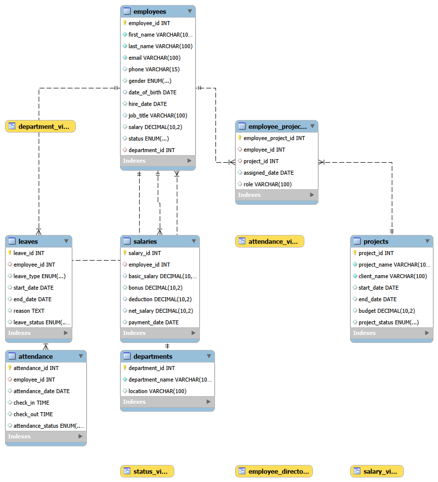

# SQL Employee Management System (HRMS)

A complete SQL-based Human Resource Management System (HRMS) project built using MySQL. This project demonstrates database design, relationships, SQL queries, joins, subqueries, views, indexes, stored procedures, functions, and triggers.

---

## Entity Relationship Diagram (ERD)

> ERD image is available inside the `ERD` folder.



---

# Features

- Employee Management
- Department Management
- Project Management
- Employee Project Assignment
- Attendance Management
- Leave Management
- Salary Management
- SQL Reports
- Joins
- Subqueries
- Views
- Indexes
- Stored Procedures
- Functions
- Triggers

---

# Technologies Used

- MySQL
- MySQL Workbench
- SQL

---

# Project Structure

```
SQL-Employee-Management-System/
│
├── Database/
│   ├── 01_database_setup.sql
│   └── 02_insert_data.sql
│
├── Queries/
│   ├── 03_basic_queries.sql
│   ├── 04_joins.sql
│   ├── 05_subqueries.sql
│   ├── 06_views.sql
│   ├── 07_indexes.sql
│   ├── 08_procedures.sql
│   ├── 09_functions.sql
│   └── 10_triggers.sql
│
├── ERD/
│   └── ERD.png
│
├── Screenshots/
│
└── README.md
```

---

# Database Tables

- departments
- employees
- projects
- employee_projects
- attendance
- leaves
- salaries

---

# SQL Topics Covered

### Database

- CREATE DATABASE
- CREATE TABLE
- PRIMARY KEY
- FOREIGN KEY
- AUTO_INCREMENT
- Constraints

### Data Manipulation

- INSERT
- UPDATE
- DELETE

### Queries

- SELECT
- WHERE
- ORDER BY
- GROUP BY
- HAVING
- LIMIT

### SQL Functions

- COUNT()
- SUM()
- AVG()
- MIN()
- MAX()
- CONCAT()

### Joins

- INNER JOIN
- LEFT JOIN
- RIGHT JOIN
- CROSS JOIN
- SELF JOIN

### Subqueries

- Single Row Subquery
- Multiple Row Subquery
- Correlated Subquery
- EXISTS
- NOT EXISTS

### Views

- CREATE VIEW
- Simple Views
- Report Views

### Indexes

- Single Column Index
- Composite Index
- Unique Index
- SHOW INDEX
- DROP INDEX

### Stored Procedures

- Procedure Creation
- Parameters
- Procedure Execution

### Functions

- User Defined Functions
- Return Values

### Triggers

- BEFORE INSERT
- AFTER INSERT
- BEFORE UPDATE
- AFTER UPDATE

---

# Reports Included

- Employee Directory
- Salary Report
- Attendance Report
- Leave Report
- Project Assignment Report
- Department Summary
- Highest Paid Employees
- Active Employees Report

---

# How to Run

### Step 1

Create the database.

Run

```
01_database_setup.sql
```

### Step 2

Insert sample data.

Run

```
02_insert_data.sql
```

### Step 3

Execute query files in order.

```
03_basic_queries.sql
04_joins.sql
05_subqueries.sql
06_views.sql
07_indexes.sql
08_procedures.sql
09_functions.sql
10_triggers.sql
```

---

# Learning Outcomes

This project demonstrates practical knowledge of:

- Database Design
- Relational Database Concepts
- SQL Query Writing
- Table Relationships
- Data Retrieval
- SQL Optimization using Indexes
- Stored Procedures
- User Defined Functions
- Triggers
- Report Generation

---

# Author

**Abhijeet Mehta**

GitHub: https://github.com/abhijeetmehta31

---